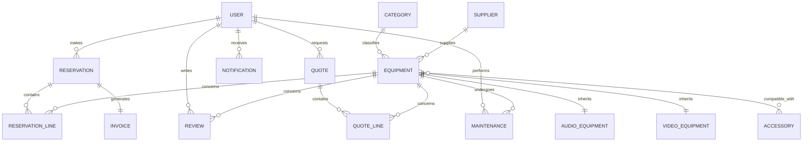

# Cahier des Charges

## Projet : EventRent — Plateforme de location de matériel audiovisuel et événementiel

_Projet de fin de cycle — Symfony 6.x/7.x & Twig_
_Nom de projet provisoire, à adapter librement._

---

## 1. Présentation générale

### 1.1 Contexte et problématique

Les organisateurs d'événements (mariages, concerts, conférences, soirées d'entreprise, tournages) ont régulièrement besoin de louer du matériel audiovisuel (sonorisation, vidéoprojection, écrans, micros) et de l'équipement d'éclairage pour une durée limitée. Aujourd'hui, ce type de location passe souvent par des échanges téléphoniques ou emails non centralisés : le client ne sait pas en temps réel ce qui est disponible, le prestataire gère son planning de location manuellement (tableurs, agenda papier), et le suivi de l'état du matériel (pannes, maintenance) n'est pas toujours connecté à la disponibilité affichée.

Cela génère trois problèmes récurrents :

- des doubles réservations sur un même équipement,
- des devis approximatifs ou tardifs,
- un matériel en panne proposé à la location car son indisponibilité n'a pas été remontée.

### 1.2 Objectifs du projet

EventRent est une plateforme web qui centralise :

- la consultation d'un catalogue de matériel AV/événementiel avec disponibilité en temps réel,
- la réservation en ligne avec calcul automatique des tarifs,
- la génération de devis et de factures liés aux réservations,
- le suivi de la maintenance du matériel par des techniciens dédiés,
- un back-office d'administration pour piloter le catalogue, les utilisateurs et les statistiques d'activité,
- une vérification météo automatique pour les événements en extérieur.

### 1.3 Périmètre fonctionnel (résumé)

| Inclus dans le périmètre                              | Hors périmètre                                                                                 |
| ----------------------------------------------------- | ---------------------------------------------------------------------------------------------- |
| Catalogue et fiches techniques du matériel            | Paiement en ligne réel (CB, etc.) — on gère un _statut_ de paiement, pas une vraie transaction |
| Réservation avec gestion de disponibilité par période | Application mobile native                                                                      |
| Devis et factures (génération de documents simples)   | Gestion comptable / export fiscal complet                                                      |
| Avis clients sur le matériel loué                     | Multi-langue                                                                                   |
| Suivi de maintenance du matériel                      | Géolocalisation cartographique avancée (juste vérification météo par ville)                    |
| Notifications par email                               | Chat en temps réel client/technicien                                                           |
| API REST de consultation du catalogue                 |                                                                                                |
| Back-office d'administration                          |                                                                                                |

---

## 2. Acteurs et rôles utilisateurs

### 2.1 Visiteur (non authentifié)

Toute personne non connectée. Peut uniquement consulter les informations publiques : catalogue, fiches matériel, avis, pages d'information (CGU, contact). Doit créer un compte pour aller plus loin.

### 2.2 Client — `ROLE_USER`

Utilisateur ayant créé un compte pour louer du matériel. C'est le rôle par défaut à l'inscription.

Responsabilités et droits :

- consulter le catalogue et les disponibilités,
- créer, consulter, modifier et annuler ses propres réservations (sous conditions, cf. règles de gestion),
- demander un devis,
- consulter ses factures,
- laisser un avis sur un équipement qu'il a effectivement loué,
- gérer son profil (informations personnelles, mot de passe).

### 2.3 Technicien — `ROLE_TECHNICIEN`

Membre du personnel chargé de l'état physique du matériel. Compte créé par un administrateur (pas d'auto-inscription).

Responsabilités et droits :

- consulter le planning de maintenance qui lui est assigné,
- déclarer une intervention de maintenance sur un équipement (panne constatée, réparation effectuée, contrôle périodique),
- mettre à jour le statut de disponibilité d'un équipement (« disponible » / « en maintenance » / « hors service »),
- consulter (lecture seule) les réservations à venir concernant le matériel dont il a la charge, pour anticiper les contrôles avant départ.

### 2.4 Administrateur — `ROLE_ADMIN`

Pilote l'ensemble de la plateforme via le back-office.

Responsabilités et droits :

- gestion complète du catalogue (équipements, catégories, accessoires, fournisseurs),
- gestion des comptes utilisateurs (création de comptes techniciens, modification de rôles, désactivation de comptes),
- gestion du cycle de vie des réservations (validation, annulation, changement de statut),
- transformation des devis en réservations,
- consultation des statistiques d'activité (taux d'occupation, chiffre d'affaires, matériel le plus loué),
- consultation de l'historique de maintenance,
- modération des avis (suppression d'un avis abusif).

### 2.5 Tableau récapitulatif des droits

| Action                         | Visiteur | Client            | Technicien | Admin                           |
| ------------------------------ | -------- | ----------------- | ---------- | ------------------------------- |
| Consulter le catalogue         | ✅       | ✅                | ✅         | ✅                              |
| Créer un compte                | ✅       | —                 | —          | —                               |
| Réserver du matériel           | ❌       | ✅                | ❌         | ✅ (pour le compte d'un client) |
| Annuler sa propre réservation  | ❌       | ✅ (conditionnel) | ❌         | ✅ (toutes)                     |
| Demander un devis              | ❌       | ✅                | ❌         | ✅                              |
| Laisser un avis                | ❌       | ✅ (si a loué)    | ❌         | ❌                              |
| Déclarer une maintenance       | ❌       | ❌                | ✅         | ✅                              |
| Modifier le catalogue          | ❌       | ❌                | ❌         | ✅                              |
| Gérer les utilisateurs         | ❌       | ❌                | ❌         | ✅                              |
| Voir les statistiques globales | ❌       | ❌                | ❌         | ✅                              |

---

## 3. Description fonctionnelle par module

### 3.1 Authentification et gestion de compte

- Inscription (formulaire avec validation : email unique, mot de passe avec contraintes de robustesse).
- Connexion / déconnexion via le formulaire natif Symfony Security.
- Hachage des mots de passe (Password Hasher).
- Page « Mon compte » : modification des informations personnelles, changement de mot de passe.
- Trois rôles distincts avec hiérarchie (`ROLE_ADMIN` hérite de `ROLE_TECHNICIEN` et `ROLE_USER` dans la config de sécurité, ou hiérarchie explicite à définir).

### 3.2 Catalogue de matériel

- Liste paginée et filtrable des équipements (par catégorie, par disponibilité, par tranche de prix).
- Fiche détaillée d'un équipement : description, caractéristiques techniques, prix/jour, photos, avis clients, disponibilité sur un calendrier.
- Les équipements sont déclinés en deux familles techniques avec des caractéristiques propres :
  - **Matériel audio** (puissance en watts, type de connectique, nombre de canaux),
  - **Matériel vidéo/projection** (résolution, luminosité en lumens, type de projection).

  Cette distinction reflète un vrai besoin métier : un client cherche une enceinte par sa puissance, un vidéoprojecteur par sa luminosité — les champs ne sont pas interchangeables. D'où une hiérarchie d'entités avec un tronc commun `Equipement`.

- Chaque équipement appartient à une catégorie et peut être associé à des accessoires compatibles (ex : un vidéoprojecteur ↔ écran de projection, support, câble HDMI).
- Chaque équipement est rattaché à un fournisseur (pour le suivi d'approvisionnement côté admin).

### 3.3 Réservations

- Le client sélectionne une période (date de début / date de fin) et un ou plusieurs équipements.
- Le formulaire de réservation utilise des **événements de formulaire** : le choix d'une catégorie met à jour dynamiquement la liste des équipements proposés et leur disponibilité sur la période choisie (`PRE_SET_DATA` pour l'état initial, `PRE_SUBMIT` pour la mise à jour après changement de catégorie).
- Le système vérifie la disponibilité réelle de chaque équipement sur la période demandée (pas de chevauchement avec une réservation existante non annulée).
- Le client renseigne le lieu de l'événement (ville + indication intérieur/extérieur).
- Calcul automatique du prix total = somme, pour chaque ligne, de `quantité × prix/jour × nombre de jours`.
- Suivi du statut de la réservation : `En attente` → `Confirmée` → `En cours` → `Terminée`, ou `Annulée`.
- Le client peut consulter l'historique de toutes ses réservations avec leur statut.
- Le client peut annuler une réservation, sous conditions (cf. règles de gestion — géré par un Voter).

### 3.4 Devis et facturation

- Un client peut demander un devis avant de confirmer une réservation (utile pour les gros événements nécessitant une validation budgétaire interne côté client).
- L'administrateur valide ou refuse le devis. Un devis validé peut être transformé en réservation confirmée.
- Une facture est générée automatiquement à la confirmation d'une réservation, avec un statut de paiement (`En attente`, `Payée`, `En retard`) — pas de transaction bancaire réelle, juste un suivi d'état.
- Le client peut consulter et télécharger ses factures depuis son espace personnel.

### 3.5 Avis et évaluations

- Un client peut laisser un avis (note + commentaire) sur un équipement, uniquement s'il a une réservation au statut `Terminée` incluant cet équipement.
- Les avis sont affichés sur la fiche de l'équipement et contribuent à une note moyenne.
- L'administrateur peut modérer (supprimer) un avis signalé comme inapproprié.

### 3.6 Maintenance du matériel

- Chaque équipement possède un historique de maintenance : date, description de l'intervention, technicien intervenant.
- Un technicien peut déclarer une intervention (panne constatée, réparation, contrôle de routine) et changer le statut de disponibilité de l'équipement.
- Tant qu'un équipement est en statut `En maintenance` ou `Hors service`, il n'apparaît pas comme disponible dans le module de réservation, même si aucune réservation ne le bloque sur la période — cela connecte directement l'état réel du matériel à sa disponibilité affichée, ce qui répond au problème identifié en 1.1.
- L'administrateur a une vue globale du planning de maintenance, toutes équipes confondues.

### 3.7 Notifications, communications et temps réel

- Envoi d'un email de confirmation à l'inscription.
- Envoi d'un email de confirmation lors de la création d'une réservation, récapitulant le matériel, les dates, le prix total et — si l'événement est en extérieur — la prévision météo du jour J (cf. 3.8).
- Envoi d'un email lors de la validation/refus d'un devis.
- Envoi d'un email au technicien lorsqu'une maintenance lui est assignée.
- Ces envois passent par le composant Mailer, de manière asynchrone si possible (pour ne pas bloquer la réponse HTTP lors d'une réservation).
- En complément de l'email, chaque notification créée (entité `Notification`, cf. modèle de données) est également poussée en temps réel dans l'interface via **Mercure** : l'utilisateur concerné est abonné à un topic personnel (`/users/{id}/notifications`) et reçoit la mise à jour sans recharger la page, via Server-Sent Events (`EventSource`).
- Cas d'usage concrets : le client voit en direct le passage de son devis à `Validé` ou de sa réservation à `Confirmée` ; l'administrateur voit apparaître en direct une nouvelle réservation ou un nouveau devis dès leur création, sans avoir à rafraîchir le back-office.
- Le payload poussé sur Mercure réutilise le groupe de sérialisation défini pour l'API (cf. 3.9), évitant de dupliquer la logique de formatage.

### 3.8 Intégration météo (API externe)

- Lorsqu'un client crée une réservation pour un événement en extérieur, le système interroge une API météo externe (ex. OpenWeatherMap) avec la ville et la date de l'événement.
- La prévision (température, risque de pluie) est affichée sur la page de confirmation et incluse dans l'email récapitulatif.
- Si la date est trop lointaine pour une prévision fiable, le système affiche un message informatif plutôt qu'une donnée erronée.

### 3.9 API REST

- Un endpoint `/api/v1/equipements` expose le catalogue au format JSON (lecture), avec gestion de groupes de sérialisation distincts pour :
  - une vue « liste » (champs essentiels : nom, catégorie, prix, disponibilité),
  - une vue « détail » (toutes les caractéristiques techniques, avis, accessoires compatibles).
- Cet endpoint permettrait, à terme, l'intégration avec un site partenaire ou une application tierce — non développée dans ce projet, mais l'API doit être fonctionnelle et testable (ex. via Postman).

### 3.10 Back-office d'administration

Espace réservé à `ROLE_ADMIN`, comprenant :

- gestion CRUD du catalogue (équipements, catégories, accessoires, fournisseurs),
- gestion des utilisateurs et de leurs rôles,
- gestion des réservations et des devis (validation, changement de statut),
- tableau de bord statistique :
  - taux d'occupation par équipement sur une période,
  - chiffre d'affaires par mois,
  - top 5 des équipements les plus loués,
- historique de maintenance consultable par équipement.

---

## 4. Cas d'utilisation

### 4.1 Liste des cas d'utilisation par acteur

**Visiteur**

- UC01 — Consulter le catalogue
- UC02 — Rechercher / filtrer le matériel
- UC03 — Consulter la fiche détaillée d'un équipement
- UC04 — Créer un compte

**Client**

- UC05 — Se connecter / se déconnecter
- UC06 — Effectuer une réservation
- UC07 — Consulter la météo prévisionnelle de son événement
- UC08 — Demander un devis
- UC09 — Consulter l'historique de ses réservations
- UC10 — Annuler une réservation
- UC11 — Consulter ses factures
- UC12 — Laisser un avis sur un équipement loué
- UC13 — Gérer son profil

**Technicien**

- UC14 — Consulter le planning de maintenance assigné
- UC15 — Déclarer une intervention de maintenance
- UC16 — Mettre à jour le statut de disponibilité d'un équipement

**Administrateur**

- UC17 — Gérer le catalogue (CRUD équipements, catégories, accessoires, fournisseurs)
- UC18 — Gérer les comptes utilisateurs et leurs rôles
- UC19 — Valider ou refuser un devis
- UC20 — Gérer le cycle de vie des réservations
- UC21 — Consulter les statistiques d'activité
- UC22 — Modérer les avis

### 4.2 Fiches détaillées des cas d'utilisation principaux

#### UC06 — Effectuer une réservation

- **Acteur principal** : Client
- **Préconditions** : le client est authentifié.
- **Scénario nominal** :
  1. Le client accède au catalogue et sélectionne une période (date de début, date de fin).
  2. Le système affiche les équipements disponibles sur cette période.
  3. Le client choisit une catégorie ; la liste des équipements proposés se met à jour dynamiquement (Form Event).
  4. Le client ajoute un ou plusieurs équipements avec leurs quantités.
  5. Le client renseigne le lieu de l'événement (ville, intérieur/extérieur).
  6. Le système calcule le prix total et l'affiche.
  7. Le client valide la réservation.
  8. Le système crée la réservation au statut `En attente`, génère une facture associée au statut `En attente de paiement`, et envoie un email de confirmation (incluant la météo si extérieur).
- **Scénarios alternatifs** :
  - 2a. Aucun équipement disponible sur la période → message d'information, le client peut modifier les dates.
  - 4a. Le client tente de réserver une quantité supérieure au stock disponible → le système refuse et indique la quantité maximale disponible.
- **Postconditions** : une nouvelle réservation existe avec ses lignes de réservation, une facture est générée.

#### UC10 — Annuler une réservation

- **Acteur principal** : Client (et Administrateur pour toute réservation)
- **Préconditions** : le client est authentifié et possède au moins une réservation.
- **Scénario nominal** :
  1. Le client accède à l'historique de ses réservations.
  2. Le client sélectionne une réservation et clique sur « Annuler ».
  3. Le système vérifie, via un Voter dédié, que :
     - la réservation appartient bien au client,
     - le statut est `En attente` ou `Confirmée`,
     - la date de début est à plus de 48h.
  4. Si les conditions sont remplies, le statut passe à `Annulée` et les équipements redeviennent disponibles sur la période libérée.
  5. Un email de confirmation d'annulation est envoyé.
- **Scénarios alternatifs** :
  - 3a. La réservation ne respecte pas une des conditions → le bouton d'annulation est désactivé/masqué et un message explique pourquoi.
  - Variante admin : un administrateur peut annuler n'importe quelle réservation, y compris hors délai (le Voter autorise `ROLE_ADMIN` sans condition de délai).

#### UC08 / UC19 — Demander, valider ou refuser un devis

- **Acteurs** : Client (demande), Administrateur (validation/refus)
- **Scénario nominal** :
  1. Le client compose une sélection d'équipements et de dates sans aller jusqu'à la réservation, et clique sur « Demander un devis ».
  2. Le système crée un devis au statut `En attente`, avec le montant estimé.
  3. L'administrateur consulte la liste des devis en attente dans le back-office.
  4. L'administrateur valide ou refuse le devis.
  5. Si validé, le devis peut être transformé en réservation (réutilisation des données du devis pour pré-remplir UC06).
  6. Le client reçoit un email l'informant de la décision.

#### UC15 — Déclarer une intervention de maintenance

- **Acteur principal** : Technicien
- **Préconditions** : le technicien est authentifié.
- **Scénario nominal** :
  1. Le technicien accède à la liste des équipements qui lui sont assignés ou signale un équipement en panne.
  2. Il renseigne une intervention : type (contrôle, réparation, panne), description, date.
  3. Il met à jour le statut de disponibilité de l'équipement (`Disponible` / `En maintenance` / `Hors service`).
  4. Le système enregistre l'intervention dans l'historique de l'équipement.
  5. Si l'équipement passe en `Hors service` alors qu'il est inclus dans une réservation `Confirmée` à venir, le système signale le conflit à l'administrateur (alerte dans le back-office).

#### UC12 — Laisser un avis sur un équipement loué

- **Acteur principal** : Client
- **Préconditions** : le client a au moins une réservation au statut `Terminée` contenant l'équipement concerné.
- **Scénario nominal** :
  1. Le client accède à la fiche de l'équipement ou à l'historique de sa réservation terminée.
  2. Le système propose l'option « Laisser un avis » uniquement si la précondition est remplie (vérification via Voter ou logique de contrôleur).
  3. Le client saisit une note et un commentaire.
  4. L'avis est publié et la note moyenne de l'équipement est recalculée.

---

## 5. Règles de gestion

- **RG01** — Un équipement ne peut être inclus dans une réservation que si aucune autre réservation active (statut différent de `Annulée`) ne le mobilise sur une période qui chevauche la période demandée.
- **RG02** — Un équipement dont le statut technique est `En maintenance` ou `Hors service` est exclu des résultats de disponibilité, indépendamment des réservations existantes.
- **RG03** — Le montant d'une ligne de réservation = `quantité × prix journalier de l'équipement × nombre de jours`. Le montant total de la réservation = somme des montants de ses lignes.
- **RG04** — Un client ne peut annuler une réservation que si son statut est `En attente` ou `Confirmée` et que la date de début est à plus de 48h de la date d'annulation. Un administrateur peut annuler sans cette contrainte de délai.
- **RG05** — Un devis a une durée de validité de 15 jours après sa création ; au-delà, il passe automatiquement au statut `Expiré` (peut être géré par une commande planifiée — piste bonus).
- **RG06** — Un avis ne peut être déposé par un client que pour un équipement présent dans au moins une de ses réservations au statut `Terminée`.
- **RG07** — Un compte `ROLE_TECHNICIEN` ne peut pas être créé par auto-inscription : seul un administrateur peut attribuer ce rôle.
- **RG08** — La facture associée à une réservation est générée automatiquement dès le passage de la réservation au statut `Confirmée`, avec un statut de paiement initial `En attente`.
- **RG09** — Le passage automatique d'une réservation au statut `Terminée` se fait lorsque la date de fin est dépassée (peut être géré par une commande planifiée — piste bonus).
- **RG10** — La prévision météo n'est affichée que si l'événement est déclaré en extérieur et que sa date est dans une fenêtre de prévision fiable (ex. 7 jours) ; au-delà, un message informatif remplace la donnée météo.

---

## 6. Aperçu du modèle de données

### 6.1 Liste des entités (15)

| Entité            | Rôle                                                                                                  |
| ----------------- | ----------------------------------------------------------------------------------------------------- |
| `User`            | Compte utilisateur (Client, Technicien, Admin via rôles)                                              |
| `Equipment`       | Entité parente (héritage CTI) — attributs communs : name, description, dailyPrice, availabilityStatus |
| `AudioEquipment`  | Sous-type d'`Equipment` — powerWatts, connectorType, channelCount                                     |
| `VideoEquipment`  | Sous-type d'`Equipment` — resolution, brightnessLumens, projectionType                                |
| `Category`        | Catégorie d'équipement                                                                                |
| `Supplier`        | Fournisseur d'un équipement                                                                           |
| `Accessory`       | Accessoire compatible avec un ou plusieurs équipements                                                |
| `Reservation`     | Réservation effectuée par un client                                                                   |
| `ReservationLine` | Ligne de réservation (jonction Reservation ↔ Equipment, avec quantity et unitPricePerDay)             |
| `Review`          | Avis laissé par un client sur un équipement                                                           |
| `Quote`           | Devis demandé par un client                                                                           |
| `QuoteLine`       | Ligne de devis (jonction Quote ↔ Equipment, avec quantity et unitPricePerDay)                         |
| `Invoice`         | Facture liée à une réservation                                                                        |
| `Maintenance`     | Intervention de maintenance sur un équipement                                                         |
| `Notification`    | Notification envoyée à un utilisateur                                                                 |

### 6.2 Relations principales

- `Equipment` (1) — (N) `AudioEquipment` / `VideoEquipment` → **héritage CTI**
- `Category` (1) — (N) `Equipment`
- `Supplier` (1) — (N) `Equipment`
- `Equipment` (N) — (N) `Accessory` → **ManyToMany simple**
- `User` (1) — (N) `Reservation`
- `Reservation` (N) — (N) `Equipment` via `ReservationLine` → **ManyToMany avec attributs**
- `User` (1) — (N) `Review`, `Equipment` (1) — (N) `Review`
- `User` (1) — (N) `Quote`
- `Quote` (1) — (N) `QuoteLine`, `Equipment` (1) — (N) `QuoteLine`
- `Reservation` (1) — (1) `Invoice`
- `Equipment` (1) — (N) `Maintenance`, `User` (technician) (1) — (N) `Maintenance`
- `User` (1) — (N) `Notification`

### 6.3 Schéma simplifié (diagramme entité-relation)

_Ce diagramme est une vue simplifiée à des fins de cahier des charges. Le MCD/diagramme de classes complet (livrable distinct) devra détailler tous les attributs, types et cardinalités exactes._

---

## 7. Contraintes techniques (rappel)

- Symfony 6.x ou 7.x, moteur de templates Twig.
- Authentification via le composant Security, hachage des mots de passe, formulaire natif.
- Au moins 1 Voter personnalisé (utilisé ici pour l'annulation de réservation).
- Endpoint API `/api/v1/...` avec Serializer (groupes de normalisation distincts liste/détail).
- Composant Mailer pour les emails transactionnels.
- Composant HttpClient pour la consultation de l'API météo externe.
- Back-office sécurisé (EasyAdminBundle ou Twig sur mesure).
- Formulaires avec Form Events (PRE_SET_DATA / PRE_SUBMIT) pour le filtrage dynamique des équipements.
- Repositories avec QueryBuilder pour les requêtes de disponibilité et les statistiques (jointures pour éviter le N+1).
- Au moins 10 pages Twig distinctes avec héritage de templates et filtres personnalisés.
- Au moins 1 test unitaire et 1 test fonctionnel (WebTestCase).
- Composant Mercure pour la diffusion temps réel des notifications (cf. 3.7).
- Pipeline CI (linter Symfony, PHPStan niveau 5 minimum, exécution des tests).
- Déploiement accessible en ligne.

### Bonus ciblés

| Bonus du barème               | Statut                                                                                                               |
| ----------------------------- | -------------------------------------------------------------------------------------------------------------------- |
| Temps réel (Mercure)          | **Implémenté** — notifications poussées en direct via SSE (cf. 3.7)                                                  |
| Asynchronisme (Messenger)     | **Implémenté** — envois d'emails asynchrones via Messenger (transport Doctrine, worker dédié dans Docker)            |
| Commandes CLI                 | **Implémenté** — `app:quotes:expire` (expiration RG05) et `app:reservations:close` (passage auto en "Terminée" RG09) |
| Tests de mutation (Infection) | Non visé                                                                                                             |
| DDD / TDD                     | Non visé                                                                                                             |

---

## 8. Livrables attendus (rappel)

- Cahier des charges complet (ce document).
- Schéma de la base de données (MCD ou diagramme de classes UML détaillé).
- Fixtures réalistes (DoctrineFixturesBundle + Faker), incluant au moins un compte de test par rôle.
- README.md avec procédure d'installation, lancement des migrations, chargement des fixtures, exécution des tests, et liste des comptes de test.
- Code source versionné avec pipeline CI fonctionnel.
- Application déployée et accessible en ligne.
