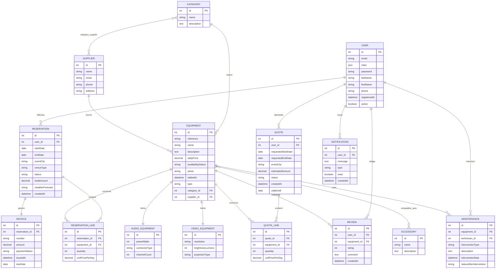

# Modèle de données — EventRent

_Document complémentaire au cahier des charges. Détaille chaque entité (table), ses champs, types, contraintes et relations._

## Légende

- **PK** : clé primaire
- **FK** : clé étrangère
- Types donnés au format Doctrine/PHP (string, text, integer, decimal, boolean, date, datetime, json)
- Les noms de champs sont donnés en camelCase (convention PHP/Doctrine) ; les noms de tables sont en snake_case.

---

## 1. `user`

| Champ        | Type               | Contraintes                          |
| ------------ | ------------------ | ------------------------------------ |
| id           | integer            | PK, auto-incrément                   |
| email        | string(180)        | unique, not null                     |
| roles        | json               | not null, défaut `["ROLE_USER"]`     |
| password     | string(255)        | not null (haché via Password Hasher) |
| lastName     | string(100)        | not null                             |
| firstName    | string(100)        | not null                             |
| phone        | string(20)         | nullable                             |
| registeredAt | datetime_immutable | not null, défaut now                 |
| active       | boolean            | not null, défaut true                |

**Relations** : 1‑N vers `Reservation`, `Review`, `Quote`, `Notification`, `Maintenance` (en tant que technicien assigné).

---

## 2. `equipment` (table parente — héritage Class Table Inheritance)

| Champ              | Type               | Contraintes                                                                       |
| ------------------ | ------------------ | --------------------------------------------------------------------------------- |
| id                 | integer            | PK, auto-incrément                                                                |
| reference          | string(50)         | unique, not null                                                                  |
| name               | string(150)        | not null                                                                          |
| description        | text               | nullable                                                                          |
| dailyPrice         | decimal(10,2)      | not null, ≥ 0                                                                     |
| availabilityStatus | string(20)         | not null, défaut `available` — enum: `available`, `maintenance`, `out_of_service` |
| photo              | string(255)        | nullable (chemin vers l'image)                                                    |
| addedAt            | datetime_immutable | not null, défaut now                                                              |
| category_id        | integer            | FK → `category.id`, not null                                                      |
| supplier_id        | integer            | FK → `supplier.id`, not null                                                      |
| type               | string(20)         | colonne discriminante de l'héritage (`audio` / `video`)                           |

**Relations** :

- N‑1 `Category`, N‑1 `Supplier`
- N‑N `Accessory` (table de jonction `equipment_accessory`)
- 1‑N `ReservationLine`, 1‑N `QuoteLine`, 1‑N `Review`, 1‑N `Maintenance`
- Héritage 1‑1 vers `AudioEquipment` ou `VideoEquipment` (même `id`, table jointe)

---

## 3. `audio_equipment` (sous-type, table jointe)

| Champ         | Type       | Contraintes                                      |
| ------------- | ---------- | ------------------------------------------------ |
| id            | integer    | PK, FK → `equipment.id`                          |
| powerWatts    | integer    | not null, > 0                                    |
| connectorType | string(50) | not null (ex : XLR, Jack 6.35mm, RCA, Bluetooth) |
| channelCount  | integer    | not null, > 0                                    |

---

## 4. `video_equipment` (sous-type, table jointe)

| Champ            | Type       | Contraintes                     |
| ---------------- | ---------- | ------------------------------- |
| id               | integer    | PK, FK → `equipment.id`         |
| resolution       | string(20) | not null (ex : 1920x1080, 4K)   |
| brightnessLumens | integer    | not null, > 0                   |
| projectionType   | string(50) | not null (ex : LCD, DLP, Laser) |

---

## 5. `category`

| Champ       | Type        | Contraintes      |
| ----------- | ----------- | ---------------- |
| id          | integer     | PK               |
| name        | string(100) | unique, not null |
| description | text        | nullable         |

**Relations** : 1‑N `Equipment`, N‑N `Supplier` (table de jonction `category_supplier`).

---

## 6. `supplier`

| Champ   | Type        | Contraintes |
| ------- | ----------- | ----------- |
| id      | integer     | PK          |
| name    | string(150) | not null    |
| email   | string(180) | nullable    |
| phone   | string(20)  | nullable    |
| address | string(255) | nullable    |

**Relations** : 1‑N `Equipment`, N‑N `Category` (côté inverse de `category_supplier`).

---

## 7. `accessory`

| Champ       | Type        | Contraintes |
| ----------- | ----------- | ----------- |
| id          | integer     | PK          |
| name        | string(150) | not null    |
| description | text        | nullable    |

**Relations** : N‑N `Equipment` via `equipment_accessory` (table de jonction sans attributs propres).

---

## 8. `reservation`

| Champ           | Type               | Contraintes                                                                                        |
| --------------- | ------------------ | -------------------------------------------------------------------------------------------------- |
| id              | integer            | PK                                                                                                 |
| user_id         | integer            | FK → `user.id`, not null                                                                           |
| startDate       | date_immutable     | not null                                                                                           |
| endDate         | date_immutable     | not null, ≥ startDate                                                                              |
| eventCity       | string(100)        | not null                                                                                           |
| venueType       | string(20)         | not null — enum: `indoor`, `outdoor`                                                               |
| status          | string(20)         | not null, défaut `pending` — enum: `pending`, `confirmed`, `in_progress`, `completed`, `cancelled` |
| totalAmount     | decimal(10,2)      | not null, défaut 0                                                                                 |
| weatherForecast | string(255)        | nullable (résumé météo enregistré au moment de la création)                                        |
| createdAt       | datetime_immutable | not null, défaut now                                                                               |

**Relations** : N‑1 `User`, 1‑N `ReservationLine`, 1‑1 `Invoice`.

---

## 9. `reservation_line` (table de jonction avec attributs)

| Champ           | Type          | Contraintes                                                          |
| --------------- | ------------- | -------------------------------------------------------------------- |
| id              | integer       | PK                                                                   |
| reservation_id  | integer       | FK → `reservation.id`, not null                                      |
| equipment_id    | integer       | FK → `equipment.id`, not null                                        |
| quantity        | integer       | not null, > 0                                                        |
| unitPricePerDay | decimal(10,2) | not null (copie du prix de l'équipement au moment de la réservation) |

**Relations** : matérialise la relation N‑N `Reservation` ↔ `Equipment` (1er ManyToMany avec attributs).

---

## 10. `quote`

| Champ              | Type               | Contraintes                                                                     |
| ------------------ | ------------------ | ------------------------------------------------------------------------------- |
| id                 | integer            | PK                                                                              |
| user_id            | integer            | FK → `user.id`, not null                                                        |
| requestedStartDate | date_immutable     | not null                                                                        |
| requestedEndDate   | date_immutable     | not null, ≥ requestedStartDate                                                  |
| eventCity          | string(100)        | nullable                                                                        |
| estimatedAmount    | decimal(10,2)      | not null, défaut 0                                                              |
| status             | string(20)         | not null, défaut `pending` — enum: `pending`, `approved`, `rejected`, `expired` |
| createdAt          | datetime_immutable | not null, défaut now                                                            |
| validUntil         | date_immutable     | not null (createdAt + 15 jours)                                                 |

**Relations** : N‑1 `User`, 1‑N `QuoteLine`.

---

## 11. `quote_line` (table de jonction avec attributs)

| Champ           | Type          | Contraintes                   |
| --------------- | ------------- | ----------------------------- |
| id              | integer       | PK                            |
| quote_id        | integer       | FK → `quote.id`, not null     |
| equipment_id    | integer       | FK → `equipment.id`, not null |
| quantity        | integer       | not null, > 0                 |
| unitPricePerDay | decimal(10,2) | not null                      |

**Relations** : matérialise la relation N‑N `Quote` ↔ `Equipment`.

---

## 12. `invoice`

| Champ          | Type               | Contraintes                                                     |
| -------------- | ------------------ | --------------------------------------------------------------- |
| id             | integer            | PK                                                              |
| reservation_id | integer            | FK → `reservation.id`, unique, not null                         |
| number         | string(50)         | unique, not null (ex : `INV-2026-000123`)                       |
| amount         | decimal(10,2)      | not null                                                        |
| paymentStatus  | string(20)         | not null, défaut `pending` — enum: `pending`, `paid`, `overdue` |
| issuedAt       | datetime_immutable | not null, défaut now                                            |
| dueDate        | date_immutable     | not null                                                        |

**Relations** : 1‑1 `Reservation`.

---

## 13. `review`

| Champ        | Type               | Contraintes                   |
| ------------ | ------------------ | ----------------------------- |
| id           | integer            | PK                            |
| user_id      | integer            | FK → `user.id`, not null      |
| equipment_id | integer            | FK → `equipment.id`, not null |
| rating       | integer            | not null, entre 1 et 5        |
| comment      | text               | nullable                      |
| createdAt    | datetime_immutable | not null, défaut now          |

**Relations** : N‑1 `User`, N‑1 `Equipment`.

---

## 14. `maintenance`

| Champ                   | Type               | Contraintes                                                   |
| ----------------------- | ------------------ | ------------------------------------------------------------- |
| id                      | integer            | PK                                                            |
| equipment_id            | integer            | FK → `equipment.id`, not null                                 |
| technician_id           | integer            | FK → `user.id`, not null                                      |
| interventionType        | string(20)         | not null — enum: `inspection`, `repair`, `breakdown`          |
| description             | text               | not null                                                      |
| interventionDate        | datetime_immutable | not null, défaut now                                          |
| statusAfterIntervention | string(20)         | not null — enum: `available`, `maintenance`, `out_of_service` |

**Relations** : N‑1 `Equipment`, N‑1 `User` (technicien).

---

## 15. `notification`

| Champ     | Type               | Contraintes                                               |
| --------- | ------------------ | --------------------------------------------------------- |
| id        | integer            | PK                                                        |
| user_id   | integer            | FK → `user.id`, not null                                  |
| message   | text               | not null                                                  |
| type      | string(50)         | nullable (ex : `reservation_confirmed`, `quote_approved`) |
| read      | boolean            | not null, défaut false                                    |
| createdAt | datetime_immutable | not null, défaut now                                      |

**Relations** : N‑1 `User`.

**Diffusion temps réel (Mercure)** : à la création d'une `Notification`, l'entité est publiée (au format JSON, via le groupe de sérialisation `notification:read`) sur le topic Mercure `/users/{user_id}/notifications`. Aucune colonne supplémentaire n'est nécessaire — le topic est dérivé de `user_id`. Côté front, chaque utilisateur connecté ouvre une connexion `EventSource` vers ce topic, avec un token Mercure scoppé à son propre `id` pour éviter qu'un utilisateur s'abonne au topic d'un autre.

---

## Récapitulatif des relations et cardinalités

| Relation                                          | Type           | Détail                                                                       |
| ------------------------------------------------- | -------------- | ---------------------------------------------------------------------------- |
| User ↔ Reservation                                | 1‑N            | un user a plusieurs réservations                                             |
| User ↔ Review                                     | 1‑N            | un user a plusieurs avis                                                     |
| User ↔ Quote                                      | 1‑N            | un user a plusieurs devis                                                    |
| User ↔ Notification                               | 1‑N            | un user a plusieurs notifications                                            |
| User ↔ Maintenance                                | 1‑N            | un technicien a plusieurs interventions                                      |
| Equipment ↔ AudioEquipment / VideoEquipment       | Héritage (CTI) | tronc commun, 2 sous-types                                                   |
| Category ↔ Equipment                              | 1‑N            | une catégorie regroupe plusieurs équipements                                 |
| Supplier ↔ Equipment                              | 1‑N            | un fournisseur fournit plusieurs équipements                                 |
| **Category ↔ Supplier**                           | **N‑N**        | sans attributs (table de jonction `category_supplier`)                       |
| **Equipment ↔ Accessory**                         | **N‑N**        | sans attributs (table de jonction `equipment_accessory`)                     |
| **Reservation ↔ Equipment** (via ReservationLine) | **N‑N**        | avec attributs : quantité, prix unitaire (ManyToMany avec table de jonction) |
| Quote ↔ Equipment (via QuoteLine)                 | N‑N            | avec attributs                                                               |
| Reservation ↔ Invoice                             | 1‑1            | une réservation génère une facture                                           |
| Equipment ↔ Review                                | 1‑N            | un équipement a plusieurs avis                                               |
| Equipment ↔ Maintenance                           | 1‑N            | un équipement a plusieurs interventions                                      |

---

## Diagramme entité-relation détaillé

