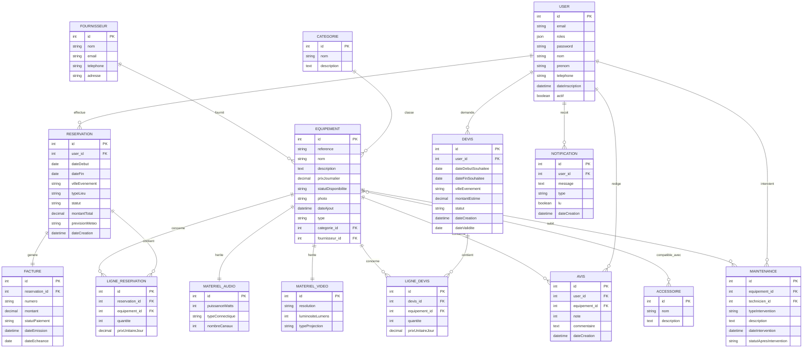

# Modèle de données — EventRent

*Document complémentaire au cahier des charges. Détaille chaque entité (table), ses champs, types, contraintes et relations.*

## Légende

- **PK** : clé primaire
- **FK** : clé étrangère
- Types donnés au format Doctrine/PHP (string, text, integer, decimal, boolean, date, datetime, json)
- Les noms de champs sont donnés en camelCase (convention PHP/Doctrine) ; les noms de tables sont en snake_case.

---

## 1. `user`

| Champ | Type | Contraintes |
|---|---|---|
| id | integer | PK, auto-increment |
| email | string(180) | unique, not null |
| roles | json | not null, défaut `["ROLE_USER"]` |
| password | string(255) | not null (haché via Password Hasher) |
| nom | string(100) | not null |
| prenom | string(100) | not null |
| telephone | string(20) | nullable |
| dateInscription | datetime | not null, défaut now |
| actif | boolean | not null, défaut true |

**Relations** : 1‑N vers `Reservation`, `Avis`, `Devis`, `Notification`, `Maintenance` (en tant que technicien assigné).

---

## 2. `equipement` (table parente — héritage Class Table Inheritance)

| Champ | Type | Contraintes |
|---|---|---|
| id | integer | PK, auto-increment |
| reference | string(50) | unique, not null |
| nom | string(150) | not null |
| description | text | nullable |
| prixJournalier | decimal(10,2) | not null, ≥ 0 |
| statutDisponibilite | string(20) | not null, défaut `disponible` — enum: `disponible`, `maintenance`, `hors_service` |
| photo | string(255) | nullable (chemin vers l'image) |
| dateAjout | datetime | not null, défaut now |
| categorie_id | integer | FK → `categorie.id`, not null |
| fournisseur_id | integer | FK → `fournisseur.id`, not null |
| type | string(20) | colonne discriminante de l'héritage (`audio` / `video`) |

**Relations** :
- N‑1 `Categorie`, N‑1 `Fournisseur`
- N‑N `Accessoire` (table de jonction `equipement_accessoire`)
- 1‑N `LigneReservation`, 1‑N `LigneDevis`, 1‑N `Avis`, 1‑N `Maintenance`
- Héritage 1‑1 vers `MaterielAudio` ou `MaterielVideo` (même `id`, table jointe)

---

## 3. `materiel_audio` (sous-type, table jointe)

| Champ | Type | Contraintes |
|---|---|---|
| id | integer | PK, FK → `equipement.id` |
| puissanceWatts | integer | not null, > 0 |
| typeConnectique | string(50) | not null (ex : XLR, Jack 6.35mm, RCA, Bluetooth) |
| nombreCanaux | integer | not null, > 0 |

---

## 4. `materiel_video` (sous-type, table jointe)

| Champ | Type | Contraintes |
|---|---|---|
| id | integer | PK, FK → `equipement.id` |
| resolution | string(20) | not null (ex : 1920x1080, 4K) |
| luminositeLumens | integer | not null, > 0 |
| typeProjection | string(50) | not null (ex : LCD, DLP, Laser) |

---

## 5. `categorie`

| Champ | Type | Contraintes |
|---|---|---|
| id | integer | PK |
| nom | string(100) | unique, not null |
| description | text | nullable |

**Relations** : 1‑N `Equipement`.

---

## 6. `fournisseur`

| Champ | Type | Contraintes |
|---|---|---|
| id | integer | PK |
| nom | string(150) | not null |
| email | string(180) | nullable |
| telephone | string(20) | nullable |
| adresse | string(255) | nullable |

**Relations** : 1‑N `Equipement`.

---

## 7. `accessoire`

| Champ | Type | Contraintes |
|---|---|---|
| id | integer | PK |
| nom | string(150) | not null |
| description | text | nullable |

**Relations** : N‑N `Equipement` via `equipement_accessoire` (table de jonction sans attributs propres).

---

## 8. `reservation`

| Champ | Type | Contraintes |
|---|---|---|
| id | integer | PK |
| user_id | integer | FK → `user.id`, not null |
| dateDebut | date | not null |
| dateFin | date | not null, ≥ dateDebut |
| villeEvenement | string(100) | not null |
| typeLieu | string(20) | not null — enum: `interieur`, `exterieur` |
| statut | string(20) | not null, défaut `en_attente` — enum: `en_attente`, `confirmee`, `en_cours`, `terminee`, `annulee` |
| montantTotal | decimal(10,2) | not null, défaut 0 |
| previsionMeteo | string(255) | nullable (résumé météo enregistré au moment de la création) |
| dateCreation | datetime | not null, défaut now |

**Relations** : N‑1 `User`, 1‑N `LigneReservation`, 1‑1 `Facture`.

---

## 9. `ligne_reservation` (table de jonction avec attributs)

| Champ | Type | Contraintes |
|---|---|---|
| id | integer | PK |
| reservation_id | integer | FK → `reservation.id`, not null |
| equipement_id | integer | FK → `equipement.id`, not null |
| quantite | integer | not null, > 0 |
| prixUnitaireJour | decimal(10,2) | not null (copie du prix de l'équipement au moment de la réservation) |

**Relations** : matérialise la relation N‑N `Reservation` ↔ `Equipement` (1er ManyToMany avec attributs).

---

## 10. `devis`

| Champ | Type | Contraintes |
|---|---|---|
| id | integer | PK |
| user_id | integer | FK → `user.id`, not null |
| dateDebutSouhaitee | date | not null |
| dateFinSouhaitee | date | not null, ≥ dateDebutSouhaitee |
| villeEvenement | string(100) | nullable |
| montantEstime | decimal(10,2) | not null, défaut 0 |
| statut | string(20) | not null, défaut `en_attente` — enum: `en_attente`, `valide`, `refuse`, `expire` |
| dateCreation | datetime | not null, défaut now |
| dateValidite | date | not null (dateCreation + 15 jours) |

**Relations** : N‑1 `User`, 1‑N `LigneDevis`.

---

## 11. `ligne_devis` (table de jonction avec attributs)

| Champ | Type | Contraintes |
|---|---|---|
| id | integer | PK |
| devis_id | integer | FK → `devis.id`, not null |
| equipement_id | integer | FK → `equipement.id`, not null |
| quantite | integer | not null, > 0 |
| prixUnitaireJour | decimal(10,2) | not null |

**Relations** : matérialise la relation N‑N `Devis` ↔ `Equipement` (2e ManyToMany avec attributs — au choix, voir note ci-dessous).

---

## 12. `facture`

| Champ | Type | Contraintes |
|---|---|---|
| id | integer | PK |
| reservation_id | integer | FK → `reservation.id`, unique, not null |
| numero | string(50) | unique, not null (ex : `FAC-2026-000123`) |
| montant | decimal(10,2) | not null |
| statutPaiement | string(20) | not null, défaut `en_attente` — enum: `en_attente`, `payee`, `en_retard` |
| dateEmission | datetime | not null, défaut now |
| dateEcheance | date | not null |

**Relations** : 1‑1 `Reservation`.

---

## 13. `avis`

| Champ | Type | Contraintes |
|---|---|---|
| id | integer | PK |
| user_id | integer | FK → `user.id`, not null |
| equipement_id | integer | FK → `equipement.id`, not null |
| note | integer | not null, entre 1 et 5 |
| commentaire | text | nullable |
| dateCreation | datetime | not null, défaut now |

**Relations** : N‑1 `User`, N‑1 `Equipement`.

---

## 14. `maintenance`

| Champ | Type | Contraintes |
|---|---|---|
| id | integer | PK |
| equipement_id | integer | FK → `equipement.id`, not null |
| technicien_id | integer | FK → `user.id`, not null |
| typeIntervention | string(20) | not null — enum: `controle`, `reparation`, `panne` |
| description | text | not null |
| dateIntervention | datetime | not null, défaut now |
| statutApresIntervention | string(20) | not null — enum: `disponible`, `maintenance`, `hors_service` |

**Relations** : N‑1 `Equipement`, N‑1 `User` (technicien).

---

## 15. `notification`

| Champ | Type | Contraintes |
|---|---|---|
| id | integer | PK |
| user_id | integer | FK → `user.id`, not null |
| message | text | not null |
| type | string(50) | nullable (ex : `reservation_confirmee`, `devis_valide`) |
| lu | boolean | not null, défaut false |
**Relations** : N‑1 `User`.

**Diffusion temps réel (Mercure)** : à la création d'une `Notification`, l'entité est publiée (au format JSON, via le groupe de sérialisation `notification:read`) sur le topic Mercure `/users/{user_id}/notifications`. Aucune colonne supplémentaire n'est nécessaire — le topic est dérivé de `user_id`. Côté front, chaque utilisateur connecté ouvre une connexion `EventSource` vers ce topic, avec un token Mercure scoppé à son propre `id` pour éviter qu'un utilisateur s'abonne au topic d'un autre.

---

## Récapitulatif des relations et cardinalités

| Relation | Type | Détail |
|---|---|---|
| User ↔ Reservation | 1‑N | un user a plusieurs réservations |
| User ↔ Avis | 1‑N | un user a plusieurs avis |
| User ↔ Devis | 1‑N | un user a plusieurs devis |
| User ↔ Notification | 1‑N | un user a plusieurs notifications |
| User ↔ Maintenance | 1‑N | un technicien a plusieurs interventions |
| Equipement ↔ MaterielAudio / MaterielVideo | Héritage (CTI) | tronc commun, 2 sous-types |
| Categorie ↔ Equipement | 1‑N | une catégorie regroupe plusieurs équipements |
| Fournisseur ↔ Equipement | 1‑N | un fournisseur fournit plusieurs équipements |
| **Equipement ↔ Accessoire** | **N‑N** | sans attributs (ManyToMany simple) |
| **Reservation ↔ Equipement** (via LigneReservation) | **N‑N** | avec attributs : quantité, prix unitaire (ManyToMany avec table de jonction) |
| Devis ↔ Equipement (via LigneDevis) | N‑N | avec attributs (optionnel si tu veux limiter à 2 ManyToMany, cf. note) |
| Reservation ↔ Facture | 1‑1 | une réservation génère une facture |
| Equipement ↔ Avis | 1‑N | un équipement a plusieurs avis |
| Equipement ↔ Maintenance | 1‑N | un équipement a plusieurs interventions |

**Note sur les ManyToMany** : le cahier des charges en exige 2 minimum. `Equipement ↔ Accessoire` et `Reservation ↔ Equipement` (via `LigneReservation`) suffisent largement à remplir cette exigence (un sans attributs, un avec attributs — tu couvres les deux variantes mentionnées dans le sujet). `LigneDevis` est un 3e ManyToMany — garde-le si tu veux que "transformer un devis en réservation" soit un simple copier des lignes, mais si tu cherches à réduire le périmètre, tu peux remplacer `Devis`/`LigneDevis` par un champ texte/JSON descriptif sur `Devis` et perdre une entité + une relation sans casser les minimums exigés (tu resterais à 13 entités, 2 ManyToMany, largement plus de 8 OneToMany/ManyToOne).

---

## Diagramme entité-relation détaillé

